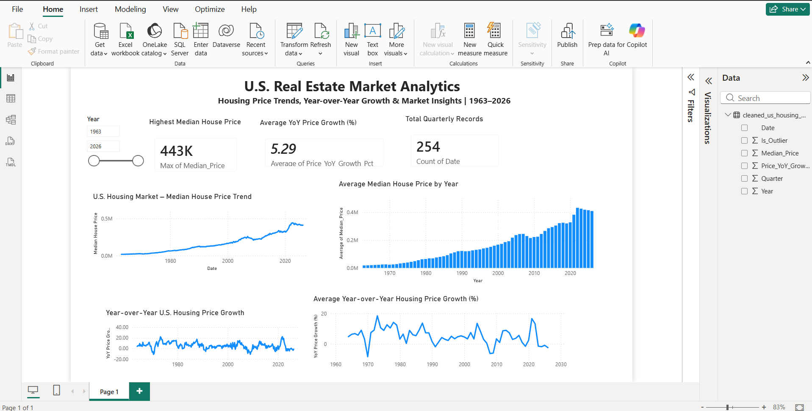
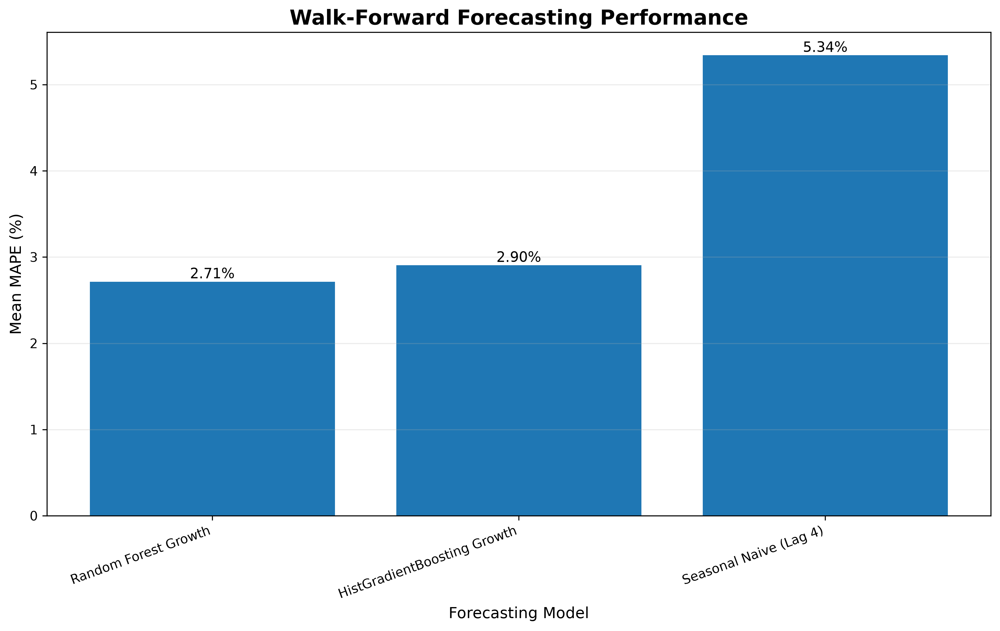
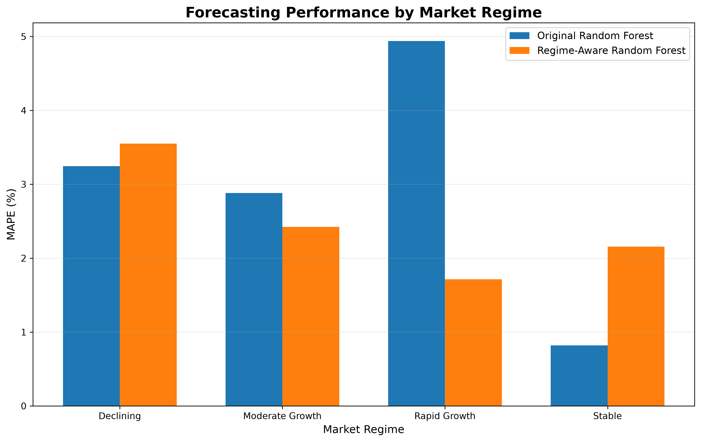
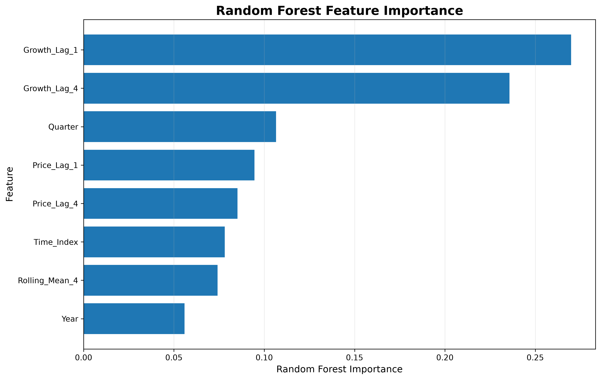
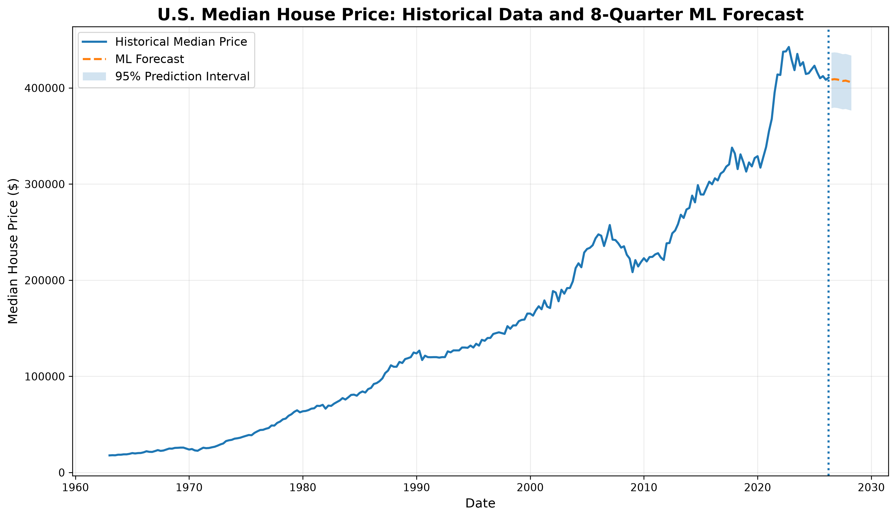

# US Real Estate Analytics & AI Predictive Pipeline

An end-to-end research-oriented framework for analyzing and forecasting long-term United States housing-market trends. The project integrates automated data acquisition, data preprocessing, feature engineering, statistical forecasting, machine-learning models, walk-forward validation, market-regime analysis, explainable AI, uncertainty estimation, and Power BI visualization.

The primary research objective is to investigate whether historical housing-market growth patterns and market-regime information can improve forecasting accuracy under changing market conditions.

---

## 🚀 Project Overview

This project provides an end-to-end framework for analyzing and forecasting U.S. housing-market data.

Historical quarterly housing-market data is automatically processed through a data engineering pipeline and transformed into analytics-ready datasets for SQL, Power BI, statistical forecasting, and machine-learning experiments.

The forecasting framework evaluates multiple approaches, including:

* ARIMA
* SARIMA
* Random Forest
* Growth-Aware Random Forest
* Regime-Aware Random Forest

The project also incorporates multiple explainability techniques to investigate which historical market features contribute most strongly to model predictions.

---

## 🔬 Research Summary

This project investigates whether historical housing-market growth dynamics and market-regime information can improve U.S. housing-price forecasting accuracy under changing market conditions.

The study compares statistical time-series models (ARIMA and SARIMA) with machine-learning approaches based on Random Forest. Growth-aware and regime-aware extensions are evaluated using walk-forward validation to reduce temporal leakage and assess model performance across different historical market conditions.

The analysis also incorporates Random Forest feature importance, permutation feature importance, and SHAP-based explainability to investigate which historical market characteristics contribute most strongly to predictions.

### Main Research Findings

- The **Growth-Aware Random Forest achieved the lowest overall MAPE of 2.42%** among the evaluated models.
- Incorporating market-regime information reduced MAPE from **4.94% to 1.71% during Rapid Growth periods**, representing a **65.30% reduction in forecasting error**.
- `Growth_Lag_1` was the most influential predictor in both Random Forest feature-importance and SHAP analyses.
- Regime-aware modeling did **not** consistently outperform the original Random Forest across all market conditions, suggesting that its effectiveness is regime-dependent.
- Future forecasts are accompanied by **empirical 95% prediction intervals** to explicitly represent forecast uncertainty.

Overall, the results suggest that historical growth dynamics are important predictors of housing prices and that market-regime information can provide additional predictive value during rapidly changing market conditions.


## 🎯 Research Objective

The central research question is:

> **Can incorporating historical growth patterns and market-regime information improve U.S. housing-price forecasting accuracy, particularly during rapidly changing market conditions?**

The project investigates this question through:

1. Feature engineering based on historical housing-price behavior
2. Statistical forecasting benchmarks
3. Machine-learning forecasting
4. Growth-aware modeling
5. Market-regime detection
6. Regime-aware forecasting
7. Walk-forward validation
8. Model comparison
9. Feature-importance analysis
10. Permutation feature importance
11. SHAP-based explainability
12. Future forecasting with empirical prediction intervals

---

## 📌 Key Results

* **2.42% MAPE** — lowest overall MAPE achieved by the Growth-Aware Random Forest.
* **65.30% reduction in MAPE** — improvement achieved by the Regime-Aware Random Forest during Rapid Growth periods.
* **Growth_Lag_1** — the most influential feature in the Random Forest feature-importance analysis and the strongest feature in the SHAP analysis.
* **8-quarter forecast horizon** — future housing-price predictions generated with empirical 95% prediction intervals.
* **1963–2026** — historical U.S. housing-market period analyzed through the project pipeline and dashboard.

The results indicate that model performance varies across market conditions rather than one forecasting approach consistently outperforming all others.

---

## ⚙️ Core Technical Features

### Automated Data Sourcing

The pipeline programmatically retrieves historical U.S. housing-market indicators from the Federal Reserve Economic Data (FRED) system.

### Data Cleaning & Transformation

Raw data is transformed into an analytics-ready structure using Python and Pandas.

Processing includes:

* Date conversion
* Numeric conversion
* Missing-value handling
* Data validation
* Dataset restructuring

### Feature Engineering

The forecasting pipeline creates temporal and historical-market features including:

* Year
* Quarter
* Time Index
* Price Lag 1
* Price Lag 4
* Growth Lag 1
* Growth Lag 4
* Rolling Mean 4
* Market Regime

These features allow machine-learning models to capture short-term, historical, and seasonal housing-market dynamics.

### Statistical Outlier Detection

A Standard Deviation Z-Score framework is used to identify potentially anomalous observations and structural changes in historical market behavior.

---

# 🤖 Forecasting & Machine Learning

The project evaluates multiple forecasting approaches to establish meaningful performance benchmarks.

## Statistical Models

### ARIMA

An ARIMA(1,1,1) model is used as a traditional time-series forecasting benchmark.

### SARIMA

A seasonal SARIMA model,

`SARIMA(1,1,1)(1,1,1,4)`

is evaluated to account for quarterly seasonal behavior.

---

## Machine-Learning Models

### Random Forest Baseline

A basic Random Forest model provides an initial machine-learning benchmark.

### Original Random Forest

A more developed Random Forest model incorporates historical price and growth features.

### Growth-Aware Random Forest

The Growth-Aware Random Forest explicitly incorporates historical housing-price growth dynamics into the feature set.

### Regime-Aware Random Forest

The Regime-Aware Random Forest incorporates historical market conditions into the forecasting process.

Four market regimes are analyzed:

* Declining
* Moderate Growth
* Rapid Growth
* Stable

---

# 🔄 Walk-Forward Validation

Because housing-price data is time-dependent, the project uses walk-forward validation rather than randomly shuffling observations.

Each validation fold trains the model on historical observations and evaluates it on a subsequent unseen time period.

This approach helps reduce temporal leakage and provides a more realistic evaluation of forecasting performance.

The regime-aware experiment used five sequential validation folds covering historical periods through 2026.

---

# 📊 Final Model Comparison

The following results were obtained from the completed forecasting experiments.

| Model                      |          MAE |         RMSE |      MAPE |
| -------------------------- | -----------: | -----------: | --------: |
| Random Forest Growth Model |     8,676.12 |    10,729.52 | **2.42%** |
| Random Forest Original     | **7,674.84** | **9,911.15** |     2.71% |
| Regime-Aware Random Forest |     7,690.20 |     9,936.54 |     2.72% |
| SARIMA(1,1,1)(1,1,1,4)     |    36,308.37 |    47,377.76 |     9.26% |
| ARIMA(1,1,1)               |    59,836.50 |    71,855.06 |    15.55% |
| Random Forest Baseline     |    92,126.11 |   107,026.55 |    24.08% |

MAPE was used as the primary model-selection metric because it provides an interpretable percentage-based measure of forecasting error.

### Overall Finding

The **Random Forest Growth Model achieved the lowest overall MAPE of 2.42%**.

The Original Random Forest achieved the lowest MAE and RMSE among the Random Forest variants, while the Growth-Aware Random Forest achieved the lowest MAPE.

Therefore, the Growth-Aware Random Forest is considered the best overall model when MAPE is used as the primary model-selection criterion.

---

# 📈 Regime-Aware Forecasting

The Regime-Aware Random Forest was evaluated separately across four historical market conditions.

| Market Regime   | Original RF MAPE | Regime-Aware RF MAPE | MAPE Improvement |
| --------------- | ---------------: | -------------------: | ---------------: |
| Declining       |            3.25% |                3.55% |           -9.35% |
| Moderate Growth |            2.88% |                2.42% |          +15.91% |
| Rapid Growth    |            4.94% |            **1.71%** |      **+65.30%** |
| Stable          |            0.82% |                2.15% |         -162.76% |

## Key Finding

The most significant result occurs during **Rapid Growth** periods.

The Original Random Forest achieved a MAPE of **4.94%**, while the Regime-Aware Random Forest reduced this to **1.71%**.

This represents a **65.30% reduction in MAPE**.

The result suggests that incorporating market-regime information can substantially improve forecasting performance during rapidly changing housing-market conditions.

However, the Regime-Aware Random Forest does not outperform the Original Random Forest in every regime.

Its performance:

* Improves during Moderate Growth
* Improves substantially during Rapid Growth
* Deteriorates during Declining periods
* Deteriorates during Stable periods

Therefore, the results do **not** support the conclusion that regime-aware modeling is universally superior.

Instead, they provide evidence that its usefulness is **regime-dependent**, with the strongest benefit occurring during rapidly changing growth periods.

---

# 🔍 Model Explainability

Model explainability was performed to investigate which features contribute most strongly to Random Forest predictions.

Three complementary approaches were evaluated:

1. Random Forest feature importance
2. Permutation feature importance
3. SHAP analysis

## Random Forest Feature Importance

The strongest features identified by the Random Forest were:

| Rank | Feature        | Importance |
| ---: | -------------- | ---------: |
|    1 | Growth_Lag_1   | **0.2698** |
|    2 | Growth_Lag_4   |     0.2357 |
|    3 | Quarter        |     0.1066 |
|    4 | Price_Lag_1    |     0.0946 |
|    5 | Price_Lag_4    |     0.0852 |
|    6 | Time_Index     |     0.0781 |
|    7 | Rolling_Mean_4 |     0.0741 |
|    8 | Year           |     0.0558 |

The results indicate that recent housing-market growth dynamics are particularly important to the Random Forest model.

---

## Permutation Feature Importance

Permutation analysis provided additional evidence that `Growth_Lag_1` is the most influential feature.

The measured importance of the remaining features was substantially smaller, while some features produced slightly negative permutation scores.

Negative permutation importance does not necessarily mean that a feature is inherently harmful. It can occur when a feature provides little independent predictive information or when correlated features allow the model to recover similar information through other variables.

---

## SHAP Explainability

SHAP analysis was used to provide a more detailed explanation of feature contributions.

The resulting mean absolute SHAP importance was:

| Rank | Feature        | Mean Absolute SHAP |
| ---: | -------------- | -----------------: |
|    1 | Growth_Lag_1   |         **0.6372** |
|    2 | Price_Lag_1    |             0.5900 |
|    3 | Price_Lag_4    |             0.4797 |
|    4 | Growth_Lag_4   |             0.3798 |
|    5 | Time_Index     |             0.3340 |
|    6 | Quarter        |             0.3238 |
|    7 | Rolling_Mean_4 |             0.2448 |
|    8 | Year           |             0.2184 |

The SHAP results further emphasize the importance of recent growth and lagged housing-price information.

The combination of tree-based feature importance, permutation analysis, and SHAP provides multiple perspectives on model behavior rather than relying on a single explainability technique.

---

# 📊 Power BI Dashboard

The project includes an interactive Power BI dashboard for exploring long-term U.S. housing-market trends from **1963–2026**.

## Dashboard Highlights

* Highest Median House Price: **$443K**
* Average YoY Price Growth: **5.29%**
* Total Quarterly Records: **254**
* Interactive **Year slicer**
* Long-term median house-price trend
* Year-over-Year housing-price growth analysis
* Annual average median house-price comparison

### Dashboard Preview



### Power BI Source File

The interactive Power BI source file is available here:

[**US_Real_Estate_Analytics_Dashboard.pbix**](./powerbi/US_Real_Estate_Analytics_Dashboard.pbix)

---

# 🔬 Research Results

The final experimental results are summarized through four key visualizations covering model validation, market-regime performance, feature importance, and future forecast uncertainty.

## 1. Walk-Forward Model Comparison

Walk-forward validation was used to evaluate model stability across multiple historical periods rather than relying on a single train/test split.



The Random Forest Growth Model achieved the lowest overall MAPE among the evaluated machine-learning models.

---

## 2. Market-Regime Comparison

The Regime-Aware Random Forest was evaluated across four market conditions:

* Declining
* Moderate Growth
* Rapid Growth
* Stable



The largest improvement occurred during Rapid Growth periods, where the Regime-Aware Random Forest reduced MAPE from **4.94% to 1.71%**, representing a **65.30% reduction in MAPE**.

However, the Regime-Aware Random Forest did not outperform the Original Random Forest in every market regime, indicating that its effectiveness depends on market conditions.

---

## 3. Feature Importance

Multiple explainability techniques were used to investigate which historical features contributed most strongly to Random Forest predictions.



Growth-related lag features, particularly `Growth_Lag_1`, were among the most influential predictors.

SHAP analysis provided an additional perspective on feature contributions and further highlighted the importance of recent growth and lagged price information.

---

## 4. Future Forecast & Prediction Uncertainty

The final forecasting pipeline generates predictions for the next eight quarters and estimates a 95% empirical prediction interval based on historical walk-forward residuals.



The forecast begins after the final observed quarter, **April 2026**, and extends through **April 2028**.

The prediction interval illustrates the uncertainty associated with long-term housing-price forecasting rather than presenting predicted values as exact future outcomes.

---

# ⚠️ Limitations

The current experiments have several limitations that should be considered when interpreting the results:

* The forecasting framework primarily relies on historical housing-price dynamics and engineered temporal features.
* The current experiments use a limited set of macroeconomic and housing-market variables.
* Historical market-regime definitions may not fully capture the complexity of real-world economic conditions.
* Long-horizon forecasts accumulate uncertainty as the prediction horizon increases.
* The empirical prediction interval is based on historical walk-forward residuals and therefore assumes that future forecast errors are reasonably represented by historical errors.
* The results are based on historical U.S. housing-market behavior and may not generalize directly to other countries or housing markets.
* Model performance may change as new economic conditions emerge.

These limitations provide opportunities for further research rather than definitive conclusions about future housing-market behavior.

---

# 🔬 Research Findings & Contribution

This project provides an empirical evaluation of whether historical growth dynamics and market-regime information can improve U.S. housing-price forecasting under different market conditions.

The integrated framework combines:

1. Automated data acquisition
2. Data cleaning and preprocessing
3. Feature engineering
4. Statistical forecasting
5. Machine-learning forecasting
6. Growth-aware modeling
7. Market-regime detection
8. Regime-aware forecasting
9. Walk-forward validation
10. Model comparison
11. Feature importance analysis
12. Permutation feature importance
13. SHAP explainability
14. Future forecasting with prediction intervals
15. Business intelligence visualization

The main finding is that **market-regime information can substantially improve forecasting performance under specific market conditions, particularly during Rapid Growth periods**.

The **65.30% reduction in MAPE during Rapid Growth periods** provides the strongest evidence supporting the hypothesis that regime information can be useful during rapidly changing market conditions.

At the same time, the deterioration observed during Stable and Declining periods demonstrates that regime-aware modeling introduces a trade-off and should be evaluated according to the specific forecasting conditions rather than being treated as universally superior.

---

# 📌 Research Interpretation

The experiments suggest three main conclusions.

### 1. Growth information matters

Recent housing-market growth is consistently among the strongest predictors of future housing prices.

`Growth_Lag_1` was the strongest feature according to the Random Forest feature-importance analysis and also ranked first in the SHAP analysis.

### 2. Regime information matters under changing conditions

Market-regime information is particularly valuable during periods of rapid housing-price growth, where the Original Random Forest experienced substantially higher forecasting error.

The reduction from **4.94% to 1.71% MAPE** during Rapid Growth represents the strongest regime-specific improvement observed in the experiments.

### 3. Model performance is regime-dependent

No single modeling strategy performs best under every historical market condition.

This suggests that future research could investigate **adaptive or dynamic model selection**, where the forecasting strategy changes according to the detected market regime.

---

# 🚀 Future Research Directions

The current results provide several directions for further investigation:

* Dynamic model selection based on detected market regime
* Ensemble forecasting across statistical and machine-learning models
* Hyperparameter optimization
* Additional macroeconomic variables from FRED
* Interest-rate and inflation features
* Housing-market supply and demand indicators
* Advanced time-series models
* Gradient boosting models such as XGBoost
* Temporal cross-validation strategies
* More robust regime-detection techniques
* Improved uncertainty estimation
* Automated future forecasting and prediction delivery
* Comparative evaluation across different U.S. housing indicators

These directions are intended as potential extensions rather than components of the current completed experiments.

---

# 📁 Repository Structure

```text
US-Real-Estate-Analytics-AI/
│
├── data/
│   ├── processed/
│   │   ├── cleaned_us_housing_market.csv
│   │   ├── ml_features.csv
│   │   └── real_estate_analytics.db
│   │
│   └── forecasts/
│       ├── explainability/
│       ├── regime_analysis/
│       ├── regime_aware/
│       ├── research_results/
│       ├── final_model_comparison.csv
│       ├── final_regime_comparison.csv
│       ├── future_price_forecast.csv
│       ├── future_forecast_with_uncertainty.csv
│       └── ...
│
├── ML/
│   ├── Forecasting/
│   │   ├── arima_baseline.py
│   │   ├── forecast_visualization.py
│   │   ├── model_evaluation.py
│   │   ├── sarima_model.py
│   │   └── validate_forecast.py
│   │
│   ├── Predictive/
│   │   ├── ablation_study.py
│   │   ├── benchmark_growth_models.py
│   │   ├── feature_engineering.py
│   │   ├── final_forecasting_pipeline.py
│   │   ├── final_research_results_visualization.py
│   │   ├── forecast_uncertainty.py
│   │   ├── future_forecast.py
│   │   ├── future_forecast_visualization.py
│   │   ├── ml_baseline.py
│   │   ├── ml_growth_model.py
│   │   ├── model_comparison.py
│   │   ├── model_explainability.py
│   │   ├── model_significance_test.py
│   │   ├── regime_analysis.py
│   │   ├── regime_aware_model.py
│   │   ├── residual_analysis.py
│   │   └── walk_forward_validation_v1.py
│   │
│   ├── forecasting_model.py
│   └── time_series_analysis.py
│
├── powerbi/
│   ├── US_Real_Estate_Analytics_Dashboard.pbix
│   └── US_Real_Estate_Analytics_Dashboard.png
│
├── data_pipeline.py
├── database_pipeline.py
├── test_queries.py
├── .gitignore
└── README.md
```
# 🛠️ Tech Stack & Methodology

| Category | Technologies / Methods | Purpose |
|----------|------------------------|---------|
| Programming | Python | Data processing, forecasting, machine-learning experiments, and automation |
| Data Processing | Pandas, NumPy | Data cleaning, transformation, feature engineering, and numerical analysis |
| Data Acquisition | FRED | Automated retrieval of historical U.S. housing-market data |
| Database | SQLite, SQL | Structured data storage, validation, and analytical queries |
| Machine Learning | Scikit-learn, Random Forest | Housing-price prediction and comparative model evaluation |
| Time-Series Forecasting | ARIMA, SARIMA | Statistical forecasting benchmarks |
| Feature Engineering | Lag features, growth features, rolling statistics, temporal features | Capturing historical housing-market dynamics |
| Validation | Walk-Forward Validation | Time-aware model evaluation and reduction of temporal leakage |
| Market Analysis | Market-Regime Detection | Evaluation of model performance under different housing-market conditions |
| Explainable AI | SHAP, Permutation Importance, Random Forest Feature Importance | Understanding feature contributions and model behavior |
| Uncertainty Estimation | Empirical Prediction Intervals | Quantifying uncertainty around future forecasts |
| Visualization | Matplotlib, Power BI | Research-result visualization and interactive business intelligence |
| Business Intelligence | Microsoft Power BI | Interactive exploration of long-term housing-market trends |
| Version Control | Git, GitHub | Project versioning, reproducibility, and research presentation |

# ▶️ Reproducibility

The project is organized into separate stages so that the data-processing, forecasting, predictive-modeling, explainability, uncertainty-estimation, and visualization components can be executed and evaluated independently.

## Experimental Workflow

The main workflow consists of:

1. **Data Acquisition**  
   Retrieve historical U.S. housing-market data from the FRED system.

2. **Data Processing**  
   Clean, validate, transform, and store the historical data using Python and Pandas.

3. **Database Pipeline**  
   Load processed data into SQLite and perform validation queries.

4. **Feature Engineering**  
   Generate temporal, lag-based, growth, and rolling statistical features.

5. **Statistical Forecasting**  
   Run ARIMA and SARIMA models as statistical forecasting benchmarks.

6. **Machine-Learning Forecasting**  
   Train Random Forest models, including the baseline, original, growth-aware, and regime-aware approaches.

7. **Walk-Forward Validation**  
   Evaluate models sequentially using historical training windows and subsequent unseen observations.

8. **Market-Regime Analysis**  
   Evaluate forecasting performance across Declining, Moderate Growth, Rapid Growth, and Stable market conditions.

9. **Model Explainability**  
   Analyze feature contributions using Random Forest feature importance, permutation importance, and SHAP.

10. **Future Forecasting**  
    Generate forecasts for the next eight quarters.

11. **Uncertainty Estimation**  
    Construct empirical 95% prediction intervals using historical walk-forward residuals.

12. **Visualization**  
    Generate research-result figures and explore long-term housing-market trends through Power BI.

## Main Scripts

The major components are organized as follows:

- `data_pipeline.py` — data acquisition, cleaning, transformation, and feature preparation.
- `database_pipeline.py` — SQLite database creation and data ingestion.
- `test_queries.py` — SQL validation and analytical queries.
- `ML/Forecasting/` — ARIMA, SARIMA, evaluation, and forecasting visualization.
- `ML/Predictive/` — machine-learning models, feature engineering, regime analysis, explainability, validation, and future forecasting.
- `powerbi/` — Power BI dashboard source file and dashboard preview.

## Reproducing the Experiments

A typical reproduction workflow is:

```bash
# Clone the repository
git clone https://github.com/Shivanisinghpari/US-Real-Estate-Analytics-AI.git

# Enter the project directory
cd US-Real-Estate-Analytics-AI

# Install the required Python packages
pip install pandas numpy scikit-learn statsmodels shap matplotlib
```

# 📈 Project Status

## Completed

* Automated data ingestion
* Data cleaning and preprocessing
* Feature engineering
* YoY growth calculation
* SQLite database pipeline
* SQL validation and analytical queries
* Power BI dashboard
* Dashboard screenshot and Power BI source file
* ARIMA forecasting
* SARIMA forecasting
* Random Forest baseline
* Original Random Forest forecasting
* Growth-Aware Random Forest
* Walk-forward validation
* Market-regime analysis
* Regime-Aware Random Forest
* Model comparison
* Residual analysis
* Random Forest feature importance
* Permutation feature importance
* SHAP explainability
* Future eight-quarter forecasting
* Empirical prediction intervals
* Research-result visualizations
* Research interpretation and documentation

## Current Focus

* Final forecasting pipeline integration
* Future prediction automation
* Final repository cleanup
* Reproducibility documentation
* Research-oriented presentation of the completed results

---

# 🧠 Overall Project Outcome

This project evolved from a data-engineering and business-intelligence pipeline into an experimental machine-learning forecasting framework.

The final system combines **data engineering, predictive analytics, time-series forecasting, machine learning, market-regime analysis, explainable AI, and uncertainty estimation** to investigate U.S. housing-market behavior.

The experiments indicate that historical growth dynamics are important predictors of future housing prices and that market-regime information can provide substantial forecasting benefits under specific conditions, particularly during Rapid Growth periods.

The strongest regime-specific result was a **65.30% reduction in MAPE**, from **4.94% to 1.71%**, when comparing the Original Random Forest with the Regime-Aware Random Forest during Rapid Growth periods.

However, the experiments also demonstrate that this benefit is not universal. The Regime-Aware Random Forest performed worse during Stable and Declining periods, highlighting the importance of evaluating forecasting strategies across different market conditions.

Overall, the project provides a complete experimental framework for investigating how historical market dynamics and regime information can influence housing-price forecasting performance while explicitly considering model validation, explainability, and prediction uncertainty.
